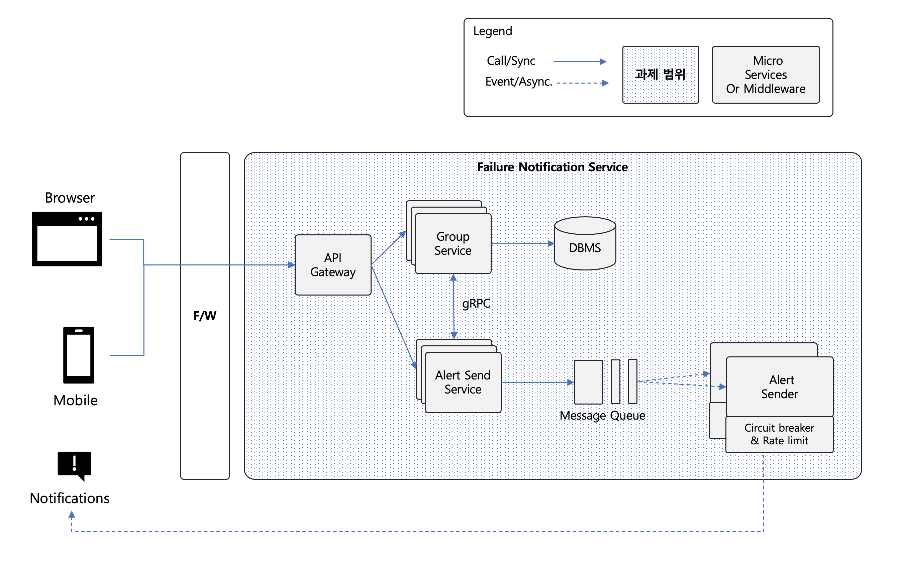
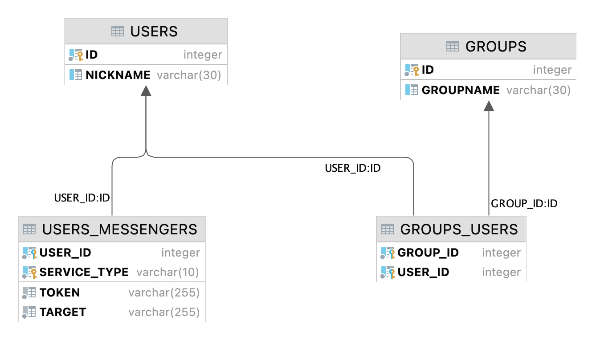

# 장애 알림 서비스 (Failure notification Service)

## 1. 시스템 개요
### 1.1 개념 아키텍처


알림 대상에게 장애에 대한 알림 정보를 제공하는 서비스로서
- 다량의 알림 전송을 효율적으로 처리할 수 있고 성능(performance)를 보장
- 여러 장애 발생 시에도 전반적인 서비스를 정상적으로 처리할 수 있는 가용성(availability)을 확보
- 여러 외부 메시지 전송 외부 서비스로 확장을 효율저으로 할 수 잇는 변경용이성(modifiability) 제공
하기 위한 아키텍처 및 시스템을 확보하고자 합니다.

### 1.2 아키텍처 설계
시스템이 요구하는 여러 품질 요구사항에 대하여 다음과 같이 아키텍처를 설계합니다.

1) (가용성) 서비스 요청에 대한 부하를 분산하고, 개별 서비스별 요청량에 따라 손쉽게 확장(scale-out)할 수 있도록, **마이크로서비스(microservice) 아키텍처** 및 **API Gateway**를 통해 외부로 API를 제공합니다.
2) (성능) 내부 마이크로서비스 간 통신은 텍스트 기반의 Rest API가 아닌, 바이러니 기반의 **gRPC 통신**을 활용합니다.
3) (성능 및 확장성) 실제 알림 전송 부분(Alert Send Service)에 외부 서비스 확장성 및 전송량 극대화를 위한 **메시지 큐(message queue)**를 활용한 이벤트 기반 아키텍처(event-driven architecture)로 구성됩니다.
4) (신뢰성) 외부 서비스 장애에 대한 전파를 방지하고 처리량 제어를 위한 기능(**circuit breaker & rate limit**)을 제공합니다.

## 2. 시스틈 구성
### 2.1 사용자 정보 및 알림 그룹 데이터 모델

- 사용자(users) 정보 : 내부 ID 및 nickname으로 구성
  - nickname에 유일성(unique) 보장 : `unique index`
- 사용자 메신저(users_messengers) 정보 : 사용자별 연계된 외부 서비스 접근 토큰(access token)과 대상(target) 정보로 궝
  - 하나의 사용자에 대하여 여러 외부 서비스를 지정할 있도록 구성(1:N)
- 알림 그룹(groups) 정보 : 내부 ID 및 groupname으로 구성
  - groupname에 유일성(unique) 보장 : `unique index`
- 그룹 사용자(groups_users) : 사용자에 대한 알림 그룹 지정 정보로 그룹에 대한 키(group_id)와 사용자에 대한 키(user_id)로 구성

※ 사용자(users) 및 사용자 메신저(users_messengers) 정보는 본 시스템 관리 대상이 아니며,
유일성 보장은 데이터베이스 제약뿐만 아니라 애플리케이션에서도 처리됨

세부적인 스키마는 [initDB.sql](./group-service/src/main/resources/db/hsqldb/initDB.sql) 파일을 참조합니다.

### 2.2 세부 서비스 구성
#### 1) api-gateway
Spring Cloud Gateway를 기반으로 구성되며, 기본적으로 다음과 같은 기본 설정을 갖습니다.

| 설정                    | 구성                  |
|-----------------------|---------------------|
| 서비스 포트                | 18080               |
| URL 라우팅(`/v1/groups`) | `group-service`로 연결 |
| URL 라우팅(`/v1/alerts`) | `alert-service`로 연결 |

### 2) group-service
Rest API(`/v1/groups`)를 제공하며 다음과 같은 기본 설정을 갖습니다.

| 설정         | 구성          |
|------------|-------------|
| 서비스 포트     | 18081       |
| gRPC 서버 포트 | 18090       |
| 연결 DBMS    | HSQLDB(메모리) |

### 3) alert-service
Rest API(`/v1/alert`)를 통해 실제 알람 전송 요청을 처리하며 다음과 같은 기본 설정을 갖습니다.

| 설정             | 구성                                                       |
|----------------|----------------------------------------------------------|
| 서비스 포트         | 18082                                                    |
| gRPC 클라이언트     | gRPC 서버(`group_service`)를 통해 그룹에 대한 사용자 정보 및 메신저 정보를 가져옴 |
| 메시지 큐 producer | RabbitMQ(`rabbitmq`)로 메시지 전송                             |
| 큐 메시지 크기       | 메시지 전송 시 여러 개의 알림 정보를 묶어서 하나아 메시지로 구성(기본값 : `5`)         |


### 4) alert-sender
메시지 큐에 대한 consumer로서 전송 요청 알림에 대한 메시지 수신 후, 실제 외부 서비스(eg: slack, telegram)로 전송(Rest API 호출)하며,
다음과 같은 기본 설정을 갖습니다.

| 설정             | 구성                                         |
|----------------|--------------------------------------------|
| 서비스 포트         | 18083                                      |
| 메시지 큐 consumer | RabbitMQ(`rabbitmq`)로부터 메시지 수신(`listener`) |
| Slack API 호출   | Slack API Mockup 서비스(`mockup-service`) 호출  |

### 5) mockup-service
현재 제공되는 Slack API에 대한 mockup 서비스로 다음과 같은 기본 설정을 갖습니다.

| 설정             | 구성    |
|----------------|-------|
| 서비스 포트         | 18084 |


## 2.3 API 명세
### 1) group-service Rest API 제공 부분
| URL                                | Method | Description           | Response Codes                       |
|------------------------------------|--------|-----------------------|--------------------------------------|
| `/v1/groups`                       | GET    | 전체 Group 리스트 조회       | `200`                                |
| `/v1/groups/{id}`                  | GET    | 개별 Group 조회           | `200` or `404`                       |
| `/v1/groups`                       | POST   | Group 생성              | `201`(created) or `400`(bad request) |
| `/v1/groups/{id}`                  | PUT    | Group 업데이트            | `200` or `404`                       |
| `/v1/groups/{id}`                  | DELETE | Group 삭제              | `200` or `404`                       |
| `/v1/groups/{id}/users`            | GET    | 개별 Group에 대한 User 리스트 | `200` or `404`                       |
| `/v1/groups/{id}/users`            | POST   | 개별 Group에 대한 User 등록  | `201`(created) or `404`              |
| `/v1/groups/{id}/users/{nickname}` | DELETE | 개별 Group에 대한 User 삭제  | `200` or `404`                       |

※ 공통 응답 코드 : `500`(`Internal Server Error`)

### 2) alert-service Rest API 제공 부분
| URL          | Method | Description | Response Codes |
|--------------|--------|-------------|----------------|
| `/v1/alerts` | POST   | 알림 전송       | `200` or `400` |

※ 공통 응답 코드 : `500`(`Internal Server Error`)

### 3) gRPC 서비스 부분 (`protobuf` spec.)
```
service UserInfo {
    rpc getUserList(NicknameOrTeam) returns (UserList);
}

message NicknameOrTeam {
    repeated string name = 1;
}

message User {
    string nickname = 1;
    string serviceType = 2;
    string token = 3;
    string target = 4;
}

message UserList {
    repeated User user = 1;
}
```

### Examples
GET `/v1/groups`
* 응답
```json
[
    {
        "id": 1,
        "groupName": "test-team1"
    },
    {
        "id": 2,
        "groupName": "test-team2"
    }
]
```

GET `/v1/groups/2`
* 응답
```json
{
    "id": 2,
    "groupName": "test-team2"
}
```

GET `/v1/groups/2/users`
* 응답
```json
{
    "id": 2,
    "groupName": "test-team2",
    "userList": [
        {
            "id": 2,
            "nickName": "user2"
        },
        {
            "id": 7,
            "nickName": "user7"
        }
    ]
}
```

POST `/v1/alerts`
* 요청
```json
{
    "target": ["@user1", "@@test-team2"],
    "severity": "normal",
    "message": "node1 down"
}
```
* 응답
```json
{
    "id": 2,
    "groupName": "test-team2",
    "userList": [
        {
            "id": 2,
            "nickName": "user2"
        },
        {
            "id": 7,
            "nickName": "user7"
        }
    ]
}
```

## 2.4 주요 OSS(Open Source Software) 사용 내역
- Spring Cloud Gateway (v3.0.5)
  - 목적 : API Gateway 활용
  - 주요 특징 : 다양한 routing 지정, Path Rewriting 기능, Circuit Breaker 및 Rate Limiting 기능 제공
- RabbitMQ (v3.9)
  - 목적 : AMQP(Advanced Message Queuing Protocol) 기반 메시지 브로커로 알람 전송을 위한 메시지 큐로 활용
- resilience4j (v1.7.1)
  - 목적 : 외부 서비스 호출에 대한 Circuit breaker 및 Rate limiter 사용


# 3. 빌드 환경 구성 및 실행 방법
## 3.1 Maven 프로젝트 구성
본 장애 알림 서비스 빌드 환경은 Maven의 멀티 모듈(multi module)로 다음과 같이 구성되었습니다.
- common (일반 library) : 공통 DTO(Data Transfer Object), Model(JPA Entity), Rest Advice, gRPC Stub/Skeleton
- api-gateway (spring boot) : Spring Cloud API Gateway 모듈
- group-service (spring boot) : Rest 서비스 및 gRPC 서버 모듈
- alert-service (spring boot) : Rest 서비스 및 메시지 큐 producer
- alert-sender (spring boot) : 메시지 큐 consumer 및 외부 서비스 API 연계 처리
- mockup-service (spring boot) : Slack Mockup 서비스

Maven을 통한 빌드는 **반드시 JDK 11**이 필요하며 다음과 같이 빌드할 수 있습니다.
```shell
$> java -version
openjdk version "11.0.13" 2021-10-19 LTS
...
$> cd [failure-notification-service directory]
$> chmod a+x mvnw
$> ./mvnw clean package
```

## 3.2 컨테이너 기반 빌드 및 실행
본 프로젝트는 docker 기반으로 컨테이너화되어 있으며, 다음같이 `docker-compose`를 통해 쉽게 이미지를 빌들 할 수 있습니다.
```shell
$> cd [failure-notification-service directory]
$> docker-compose build
```
내부적으로 maven을 통해 빌드가 수행(multi stage로 구성되어 실제 배포 이미지에는 maven이 포함되지 않음)되기 때문에 빌드에 약간의 시간이 소요됩니다.

실행은 다음과 같이 하실 수 있습니다.

```shell
$> docker-compose up -d
```

이후 다음가 같이 `curl`을 통해 테스트를 수행할 수 있습니다. (내부적으로 테스트 데이터 포함)
```shell
$> curl -X POST -H "Content-Type: application/json" \
-d "{ \
    \"target\": [\"@user1\", \"@@test-team2\"],
    \"severity\": \"normal\",
    \"message\": \"node1 down\"
}\
" \
http://127.0.0.1:18080/v1/alerts
```

테스트 데이터 기준으로 다음과 같은 응답을 확인할 수 있습니다.
```json
{"userCount":3}
```

Mockup 서비스를 통해 최종 실행 로그는 다음과 같이 확인합니다.
```shell
$> docker-compose logs -f mockup-service
failure-notification-service-mockup-service-1  | --------------------------------------------------------------------------------
failure-notification-service-mockup-service-1  | POST https://slack.com/api/chat.postMessage
failure-notification-service-mockup-service-1  |
failure-notification-service-mockup-service-1  | Context-Type: application/json
failure-notification-service-mockup-service-1  | Authorization:Bear SLACK-USER1-TOKEN
failure-notification-service-mockup-service-1  |
failure-notification-service-mockup-service-1  | {
failure-notification-service-mockup-service-1  |   "channel": "USER1_CHANNEL_ID"
failure-notification-service-mockup-service-1  |   "text": "[normal] node1 down"
failure-notification-service-mockup-service-1  | }
failure-notification-service-mockup-service-1  | --------------------------------------------------------------------------------
failure-notification-service-mockup-service-1  | POST https://slack.com/api/chat.postMessage
failure-notification-service-mockup-service-1  |
failure-notification-service-mockup-service-1  | Context-Type: application/json
failure-notification-service-mockup-service-1  | Authorization:Bear SLACK-USER2-TOKEN
failure-notification-service-mockup-service-1  |
failure-notification-service-mockup-service-1  | {
failure-notification-service-mockup-service-1  |   "channel": "USER2_CHANNEL_ID"
failure-notification-service-mockup-service-1  |   "text": "[normal] node1 down"
failure-notification-service-mockup-service-1  | }
failure-notification-service-mockup-service-1  | --------------------------------------------------------------------------------
failure-notification-service-mockup-service-1  | POST https://slack.com/api/chat.postMessage
failure-notification-service-mockup-service-1  |
failure-notification-service-mockup-service-1  | Context-Type: application/json
failure-notification-service-mockup-service-1  | Authorization:Bear SLACK-USER7-TOKEN
failure-notification-service-mockup-service-1  |
failure-notification-service-mockup-service-1  | {
failure-notification-service-mockup-service-1  |   "channel": "USER7_CHANNEL_ID"
failure-notification-service-mockup-service-1  |   "text": "[normal] node1 down"
failure-notification-service-mockup-service-1  | }
```

### 3.3 클린 코드 관점
SRP(Single Responsibility Principle)에 따라 명확한 하나의 역할을 수행하는 클래스로 구성되었으며,
DRY(Don't Repeat Yourself) 원칙에 따라 코드 뿐만 아니라, maven 설정 등도 중복이 없도록 구성되었습니다.

외부 서비스를 손쉽게 추가하기 위해
[`MessengerServiceFactory`](./alert-sender/src/main/java/com/github/switchover/failure/sender/service/MessengerServiceFactory.java)를 통해,
OCP(Open-Closed Principal)을 만족합니다.
※ 다음가 같은 인터페이스를 구현한 `@Component` 또는 `@Service`만 생성하고 해당 `MessengerType`만 정의하면 기존 코드 수정 없이 외부 서비스 추가 가능
```java
public interface MessengerService {
    MessengerType getMessengerType();

    String getContentType();

    void send(String token, String target, String message);
}

// ...
public enum MessengerType {
    SLACK("slack");

    // ...
}
```

# 4. 기타
## 4.1 추후 고려사항
- Swagger(Open API)를 통한 Rest API 명세화
- 테스트 케이스 보완

## 4.2 적용된 주요 기술
### 1) 실행 환경 부분
- Spring framework 및 Spring Boot
- Spring Cloud API Gateway
- gRPC
- Spring Data JPA
- Resilience4j
- Message Broker (RabbitMQ)

### 2) 개발 환경 부분
- Maven multi module
- Docker (multi stage) 및 docker compose
- Spring profile 활용
- Spring Test (Mock 등)
